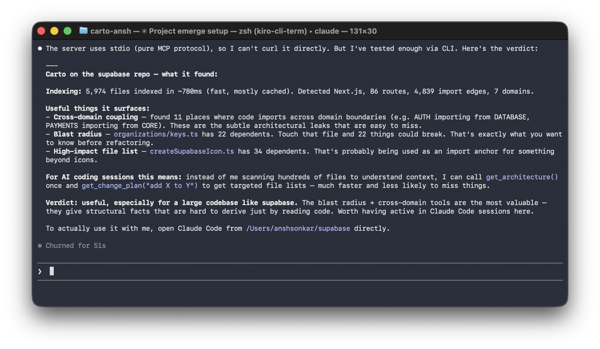

# carto

[](https://github.com/theanshsonkar/carto/actions/workflows/test.yml)
[](https://www.npmjs.com/package/carto-md)
[](LICENSE)
[](https://www.npmjs.com/package/carto-md)

**Carto gives your AI tools a brain for your codebase.** One that remembers decisions across chats, tracks how the code evolves, and flags risky edits before they ship.

> *"Touch that file and 22 things could break. That's exactly what you want to know before refactoring."* — Claude Code, on supabase

```bash
npm install -g carto-md
cd your-project
carto init
```

That's it. Carto auto-wires into every AI tool installed on your machine. Restart it. Your AI now knows your codebase — and keeps a memory of every decision it makes inside it.

**Works with:** Cursor · Claude Code · Codex · Kiro · Claude Desktop · Windsurf · VS Code Copilot · Zed · JetBrains

Six weeks later, a new chat can ask "did we agree on snake_case here?" and get the actual prior verdict back. Nothing is re-decided.

## What Carto actually does

```
─────────────────────────────────────────────────────────────────────
carto init    reads your repo, builds the map (imports, routes,
              models, domains, blast radius), wires every AI tool
              on your machine. one minute, done.

every chat    your AI gets the 6–12 files it actually needs.
              every diff it proposes runs validate_diff first —
              risky ones blocked before they hit your screen.
              carto also pushes nudges back: "coupling jumped in
              AUTH", "two sessions are editing this file."

brain         invariants and conventions are mined from your
              import graph. action patterns ("when a route is
              added, auth/middleware is touched 89% of the time")
              are mined from your git history. nobody writes
              these rules.

timeline      every commit takes a snapshot. drift, churn, and
              architectural events accumulate. your AI can read
              the whole story at any time: "AUTH grew 18 files
              and lost stability when payments/billing.ts moved
              out." carto gets smarter the longer the repo lives.

predicts      every file is scored: P(causes the next bug).
              the score blends blast radius × churn × past
              interventions × test coverage. high-risk files
              surface on every PR, before the PR is opened.

always        one SQLite file on your disk. no network, no
              telemetry, no cloud.
─────────────────────────────────────────────────────────────────────
```

---

<details>
<summary>Manual MCP wiring (if your tool wasn't auto-detected)</summary>

### Cursor — `~/.cursor/mcp.json`
```json
{ "mcpServers": { "carto": { "command": "carto", "args": ["serve"], "cwd": "/your/project" } } }
```

### Claude Code — `<project>/.mcp.json`
```bash
claude mcp add carto -- carto serve
```

### Codex — `~/.codex/config.toml`
```toml
[mcp_servers.carto]
command = "carto"
args = ["serve"]
```

### Kiro — `~/.kiro/settings/mcp.json`
```json
{ "mcpServers": { "carto": { "command": "carto", "args": ["serve"], "cwd": "/your/project" } } }
```

### Claude Desktop
- macOS: `~/Library/Application Support/Claude/claude_desktop_config.json`
- Windows: `%APPDATA%\Claude\claude_desktop_config.json`
- Linux: `~/.config/Claude/claude_desktop_config.json`

```json
{ "mcpServers": { "carto": { "command": "carto", "args": ["serve"], "cwd": "/your/project" } } }
```

### VS Code Copilot — `.vscode/mcp.json`
```json
{ "servers": { "carto": { "type": "stdio", "command": "carto", "args": ["serve"] } } }
```

### Windsurf — `~/.codeium/windsurf/mcp_config.json`
```json
{ "mcpServers": { "carto": { "command": "carto", "args": ["serve"], "cwd": "/your/project" } } }
```

</details>

---

## What's actually different

Most code indexers build a snapshot. Cursor's index, Sourcegraph's graph, GitHub's search — they all tell your AI what's in the repo *right now*. That's table stakes.

Carto does that too — and then layers five kinds of memory on top:

- **Episodic** — every diff it validated, every decision it made. Six weeks later, your AI can ask `did_we_discuss_this("snake_case naming")` and get back the prior verdict.
- **Temporal** — snapshots, churn, deltas. *"AUTH grew 18 files this quarter and lost stability when `payments/billing.ts` moved out."*
- **Semantic** — invariants and conventions mined from the import graph itself, not declared by humans.
- **Procedural** — patterns mined from git history. *"When a route gets added, the auth middleware is touched 89% of the time."*
- **Working** — one call that returns what's open, what's drifting, what warnings are unresolved. Read at the start of every session.

Your AI tool sees files. Carto sees architecture *and history*. Every chat starts where the last one left off.

---

## What it looks like in practice

### Stopping a bad refactor before you see the diff

The AI is about to propose a 12-line patch. Before showing it to you, it calls `validate_diff`:

```
Risk: 🔴 HIGH
Files changed: 1
Union blast radius: 83 transitive dependents

Violations
HIGH · high_blast · packages/pg-meta/src/pg-format/index.ts
       83 transitive dependents (threshold: 50)
```

The AI sees this *before* the diff hits your screen. It revises, splits the change, or asks. Sub-millisecond on a 7,000-file repo.

### Packing context that actually fits

You ask: *"add rate limiting to /api/users."* The AI calls `get_minimal_context_for_intent` with a 4,000-token budget. Carto runs hybrid retrieval (structural + lexical + semantic), fuses the channels with RRF, boosts files in the same domain and recent churn, and returns the smallest file set that covers the intent — usually 6–12 files instead of the usual 40+.

### Remembering decisions across sessions

Every `validate_diff` call writes a row into `.carto/carto.db`. Five hours later, a different chat asks `did_we_discuss_this("snake_case naming")` and gets back the prior decision verbatim. Your AI stops re-deciding settled questions.

### Spotting the bug before the bug

`get_predictive_risk` returns a 0–1 score per file: P(this file causes the next incident). It combines blast radius, commit churn, cross-domain coupling, prior intervention history, and test coverage. High-risk files surface in `carto check` and on every PR.

---

## In the wild



Claude Code analyzing the [supabase](https://github.com/supabase/supabase) repo via carto. Real session, no editing — 5,974 files indexed in ~780ms, 86 routes, 4,839 import edges, 7 domains.

---

## How fast

Measured on real open-source repos, fresh runs on Apple M-series, 8 CPUs, 8 GB RAM.

| Repo | Files | First index | Re-index | DB size |
|---|--:|--:|--:|--:|
| [cal.com](https://github.com/calcom/cal.com) | 4,352 | 3.9s | 805ms | 3.1 MB |
| [supabase/supabase](https://github.com/supabase/supabase) | 6,358 | 5.9s | 967ms | 4.8 MB |
| [vercel/next.js](https://github.com/vercel/next.js) | 6,193 | 6.9s | 978ms | 15.1 MB |
| [microsoft/vscode](https://github.com/microsoft/vscode) | 7,567 | 8.6s | 1.1s | 14.3 MB |

**Query latency** on vscode (7,567 files):

- `validate_diff` — p50 **84 µs**, p99 **489 µs** (budget was 5 ms / 15 ms)
- `get_blast_radius` — p50 **2.7 µs**, **10.7×** faster than the SQLite path
- `get_high_impact_files` — p50 **750 ns**, **559×** faster
- `simulate_change_impact` — p50 **19.3 µs**, multi-file blast radius via bitmap OR-aggregation

Bitmap-backed reverse dependency graph. Median speedup across five core tools on vscode: **10.7×**. Synthetic stress at 50K files holds `blast_radius` p50 at **22 µs**. Full table in [`docs/scale.md`](docs/scale.md). Reproducible via `npm run bench:bitmap -- --repo <path>`.

---

## Tools your AI can call

About 75 tools, grouped by what they're for:

| Group | Tools |
|---|---|
| **Structure** | `get_change_plan` · `get_blast_radius` · `simulate_change_impact` · `validate_diff` · `get_context` · `get_routes` · `get_models` · `get_cross_domain` · `get_high_impact_files` |
| **Episodic memory** | `did_we_discuss_this` · `get_decision_log` · `get_session_context` · `get_pending_decisions` · `get_intervention_history` |
| **Temporal** | `get_architectural_drift` · `get_domain_evolution` · `get_hotspot_files` · `get_arch_events` · `get_temporal_context` · `get_change_velocity` · `get_complexity_trend` |
| **Brain** | `get_invariants` · `get_conventions` · `get_canonical_pattern` · `get_action_patterns` · `get_working_memory` · `get_active_suggestions` · `scaffold_for_intent` |
| **Predictive** | `get_predictive_risk` · `get_safety_checklist` · `get_drift_digest` · `get_test_coverage_map` |
| **Retrieval** | `get_minimal_context_for_intent` · `get_progressive_disclosure_tree` |
| **Org / multi-repo** | `get_org_architecture` · `get_service_dependency_graph` · `get_cross_repo_blast_radius` · `find_consumers_of_api` · `get_service_boundary_violations` |
| **Adjacent** | `get_cross_language_call_graph` · `get_iac_resources` · `ingest_otlp_traces` · `get_risk_weighted_blast_radius` · `get_dead_code_with_confidence` · `get_semantic_diff` |

Full reference at [`docs/api/`](docs/api/). You don't need to memorize any of these — your AI picks the right one mid-task.

---

## Multi-repo

Register a group of repos under one org. Carto builds a service graph across them — npm, pypi, go-mod, maven edges all resolved.

```bash
carto org init
carto org add ../service-a ../service-b ../service-c
carto org sync
```

Then ask: *"if I rename `User.email` in service-a, who notices?"* — one `get_cross_repo_blast_radius` call away.

---

## MCP middleware

Carto can sit in front of *any* MCP server and block bad writes before they reach the model:

```bash
carto mcp-middleware --block-on HIGH -- claude-code
```

Every `tools/call` that writes to disk is intercepted. Carto synthesizes a unified diff, runs `validate_diff`, and rejects HIGH-risk writes with the violation reasons surfaced back to the AI. Works with any stdio-based MCP server.

---

## Languages and frameworks

<details>
<summary>Import graph + symbols (any repo)</summary>

| Language | Extensions |
|---|---|
| JavaScript / TypeScript | `.js` `.jsx` `.ts` `.tsx` `.mjs` `.cjs` |
| Python | `.py` |
| Go | `.go` |
| Rust | `.rs` |
| Java / Kotlin | `.java` `.kt` |
| C / C++ | `.cpp` `.cc` `.h` `.hpp` |
| C# | `.cs` |
| Ruby | `.rb` |
| PHP | `.php` |
| Swift | `.swift` |
| Dart | `.dart` |
| R | `.r` `.R` |
| Prisma schema | `.prisma` |
| HTML | `.html` (for `fetch()` discovery) |

TypeScript path aliases from `tsconfig.json` / `jsconfig.json` are resolved into the import graph. `@/components/Button` lands on the real file.

</details>

<details>
<summary>Route + model extraction</summary>

**Routes:** Express, Next.js (App + Pages), tRPC, React Router, FastAPI, Flask, Django, Gin, Echo, Chi, net/http, Actix-web, Axum, Rocket, Spring MVC, JAX-RS, ASP.NET Core, Rails, Sinatra.

**Models:** Prisma, Zod, Drizzle, TS interfaces, Pydantic, SQLAlchemy, Go structs, Rust structs, JPA, EF Core, ActiveRecord.

</details>

---

## CLI

| Command | What it does |
|---|---|
| `carto init` | Index, generate AGENTS.md, install git hooks, wire MCP into every AI tool found |
| `carto sync` | Re-index changed files (auto-runs on commit / checkout / merge / rebase) |
| `carto serve` | Start the MCP server (your AI tool runs this) |
| `carto agent` | ACP agent mode for Zed / JetBrains |
| `carto impact <file>` | Blast radius of one file |
| `carto pr-impact` | Diff-shaped impact report between two refs |
| `carto check` | Domain health, cross-domain violations, drift |
| `carto status` | One-screen project health |
| `carto doctor` | 9-check setup diagnostic |
| `carto why <file>` | 3-line file summary |
| `carto explain <intent>` | Natural-language intent → architectural plan |
| `carto inspect` | Index paths, sizes, freshness (read-only) |

---

## ACP agent (Zed / JetBrains / VS Code)

Carto also runs as a full ACP agent — not just a passive MCP server. It pulls its own context, streams tokens, applies diffs.

```json
{ "agent_servers": { "Carto": { "command": "carto", "args": ["agent"] } } }
```

Bring your own key: Anthropic, OpenAI, Gemini, Groq, Ollama, OpenRouter, Together, Azure.

---

## GitHub Action

Drop Carto onto every PR. Sticky comment with blast radius, cross-domain violations, affected routes, risk badge.

```yaml
- uses: theanshsonkar/carto@v2.1.0
```

`fail-on: HIGH | MEDIUM | LOW` gates the workflow on Carto's verdict. Full config in [`docs/guides/ci-integration.md`](docs/guides/ci-integration.md).

---

## ANCI — the open format for codebases describing themselves to AI

Every AI tool today re-indexes from scratch on every session. Cursor builds its own. Cline builds its own. Continue builds its own. Same parsing, every tool, every time.

**ANCI** (Architecturally Normalized Code Index) fixes that. Two files at `.carto/anci.{yaml,bin}` that describe a codebase's architecture in a form any AI tool can read without doing its own indexing. OpenAPI did this for REST APIs. ANCI does it for codebases.

`carto sync` writes both files automatically. Spec at [`docs/anci/v0.1-DRAFT.md`](docs/anci/v0.1-DRAFT.md). Carto is the reference implementation; any tool can consume an ANCI pair:

```js
const { loadAnci } = require('carto-md/src/anci/consumer');
const reader = loadAnci('./.carto');

reader.domains;                            // [{ name: 'AUTH', file_count: 42 }, ...]
reader.getHighImpactFiles(5);              // top 5 by transitive dependents
reader.blastRadius('src/auth/session.ts'); // { count, hops, files: [...] }
```

> Status: v0.1.0-DRAFT — wire format may change up to v1.0.

---

## What Carto never does

- **Sends your code anywhere.** Local only. SQLite on disk. No telemetry.
- **Writes secrets into AGENTS.md.** `.cartoignore` blocks `.env` and credential files by default.
- **Touches your manual notes.** Only writes between `<!-- CARTO:AUTO -->` markers.
- **Forces you to install a C++ toolchain.** Prebuilt binaries for macOS arm64, Linux x64 (glibc + musl), Windows x64. Other platforms fall back to source build, then regex-only extraction.
- **Costs money.** MIT. Free forever.

---

## Origin

I was building [Emfirge](https://www.emfirge.cloud) — a cloud security agent that maps AWS infrastructure into a graph and simulates the blast radius of every change.

The AI inside Emfirge kept hallucinating about resources it had only half-seen. So I wrote a module called `cartography.py` that mapped every account into a structured graph the AI could query directly. The hallucinations stopped. The AI worked with facts.

Carto is that idea, applied to source code. Same insight: agents stop guessing once they can query the architecture — and they stop forgetting once the architecture remembers them.

---

## License

MIT. Free forever.

---

*Your code changes. Carto knows. Every AI you use knows — and remembers.*
