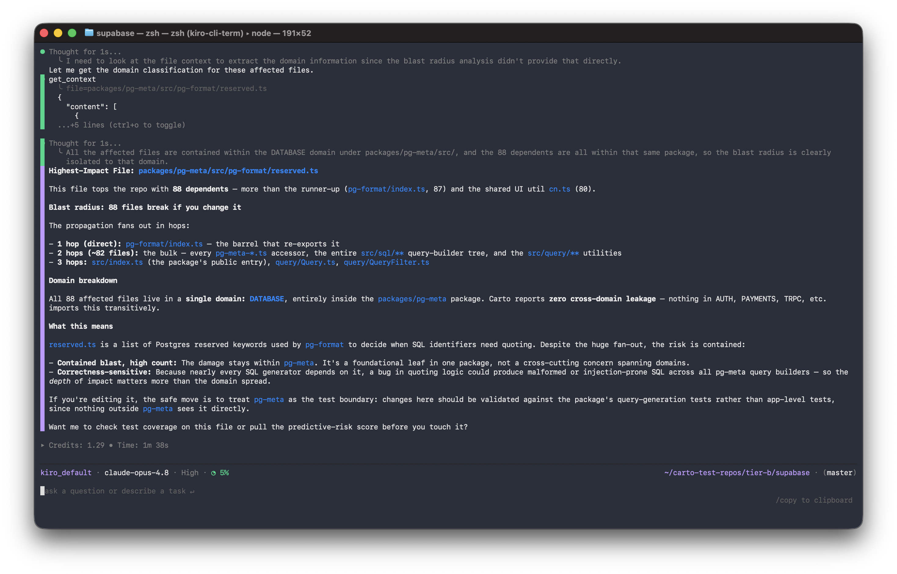

# Carto

**The portable AI container for your codebase. Package a repo once — every AI tool understands it in seconds, and knows what breaks before it changes anything.**

[Docs](docs/) · [Quickstart](docs/quickstart.md) · [Tools](#tools-your-ai-can-call) · [ANCI Spec](docs/anci/v0.1-DRAFT.md) · [Benchmarks](docs/scale.md) · [Changelog](CHANGELOG.md)

[](https://github.com/theanshsonkar/carto/actions/workflows/test.yml)
[](https://www.npmjs.com/package/carto-md)
[](LICENSE)
[](https://www.npmjs.com/package/carto-md)

---

> **Docker made apps portable. Carto makes codebases portable for AI.**

Every AI tool re-reads your entire codebase from scratch, every single session. Cursor builds its own index. Copilot builds its own. Claude Code builds its own. Same parsing, every tool, every time — and none of them remember what they learned yesterday.

Carto fixes that. It packages a repository into a **portable AI container** that captures its architecture, dependencies, engineering history, and safety context — so any AI coding assistant understands the project in seconds instead of rediscovering it from scratch. And because the container knows how everything connects, it can tell you **what breaks before you change it.**

One SQLite file on your disk. No network. No telemetry. No cloud.

### 📦 What is an Carto Container?

When you run `carto init`, it doesn't spin up a Docker daemon or create virtual network bridges. Instead, it creates a logical container right in your project root (`.carto/`).

This container houses your codebase's **ANCI** (Architecturally Normalized Code Index) schema. It acts as a universal, portable memory bank. No matter which AI tool you swap to—or if you push your code to a remote CI pipeline—the container ensures your AI starts the session with perfect structural awareness.




|  |  |
|---|---|
| 🗺️ **Architecture** | Import graph, routes, models, and auto-detected domains — the whole shape of the repo, mapped once. |
| 💥 **Blast Radius** | "Touch this file and 22 things break." Transitive impact of any change, in microseconds. |
| 🧠 **Memory** | Every decision and validated diff is remembered across sessions. Ask *"did we agree on snake_case here?"* six weeks later and get the actual verdict. |
| ⏳ **History** | Snapshots every commit. Tracks drift, churn, and architectural events. The container gets smarter the longer the repo lives. |
| 🎯 **Predictive Risk** | Every file scored 0–1: *P(this causes the next incident)*. High-risk files surface before the PR is opened. |
| 📦 **Portable (ANCI)** | The container is an open format — `.carto/anci.{yaml,bin}`. Any AI tool can read it without re-indexing. |

---

## Use Carto

|  |  |
|---|---|
| ### 🧑‍💻 I use AI coding tools | ### 🔧 I'm building AI dev tools |
| Install once and Carto auto-wires into every AI tool on your machine. Your assistant instantly knows your architecture, remembers past decisions, and gets blocked from risky edits. **[→ Quick start](#quick-start)** | Consume the portable container directly via the ANCI format, or query it live through ~75 MCP tools. Stop building your own index. **[→ Build on Carto](#build-on-carto)** |

**Works with:** Cursor · Claude Code · Codex · Kiro · Claude Desktop · Windsurf · VS Code Copilot · Zed · JetBrains

---

## Quick start

```bash
npm install -g carto-md
cd your-project
carto init
```

That's it. `carto init` reads your repo, builds the container, and wires itself into every AI tool it finds. Restart the tool. Your AI now knows your codebase — and keeps a memory of every decision it makes inside it.

### Wiring it into your AI tool

`carto init` auto-detects the AI tools on your machine and writes each one's MCP config for you. If you'd rather wire it by hand, the MCP server config is just:

```json
{
  "mcpServers": {
    "carto": {
      "command": "carto",
      "args": ["serve"]
    }
  }
}
```

Point any MCP client at that and restart it — the tool spawns `carto serve` on demand, and every chat starts with your architecture, blast radius, and past decisions already loaded. Exact config file per tool is below.

<details>
<summary>Manual MCP wiring for every other tool (if it wasn't auto-detected)</summary>

### Cursor — `~/.cursor/mcp.json`
```json
{ "mcpServers": { "carto": { "command": "carto", "args": ["serve"], "cwd": "/your/project" } } }
```

### Claude Code — `<project>/.mcp.json`
```bash
claude mcp add carto -- carto serve
```

### Codex — `~/.codex/config.toml`
```toml
[mcp_servers.carto]
command = "carto"
args = ["serve"]
```

### Kiro — `~/.kiro/settings/mcp.json`
```json
{ "mcpServers": { "carto": { "command": "carto", "args": ["serve"], "cwd": "/your/project" } } }
```

### Claude Desktop
- macOS: `~/Library/Application Support/Claude/claude_desktop_config.json`
- Windows: `%APPDATA%\Claude\claude_desktop_config.json`
- Linux: `~/.config/Claude/claude_desktop_config.json`

```json
{ "mcpServers": { "carto": { "command": "carto", "args": ["serve"], "cwd": "/your/project" } } }
```

### VS Code Copilot — `.vscode/mcp.json`
```json
{ "servers": { "carto": { "type": "stdio", "command": "carto", "args": ["serve"] } } }
```

### Windsurf — `~/.codeium/windsurf/mcp_config.json`
```json
{ "mcpServers": { "carto": { "command": "carto", "args": ["serve"], "cwd": "/your/project" } } }
```

</details>

### How it works

1. **`carto init` builds the container.** It parses your repo (imports, routes, models, domains, blast radius), writes it to `.carto/`, and auto-wires every AI tool on your machine.
2. **Your AI loads it instead of re-reading everything.** Every chat starts with the architecture already known — the right 6–12 files, not the usual 40+.
3. **Every proposed diff is checked first.** Risky changes are graded and flagged *before* they hit your screen. Carto also nudges: *"coupling jumped in AUTH," "two sessions are editing this file."*
4. **The container remembers.** Decisions, validations, and drift accumulate in one SQLite file. Next session picks up where the last left off.

---

## An index is not a container

Most tools build an **index** — a snapshot of what's in the repo *right now*. Stateless. Thrown away at the end of the session. Rebuilt from scratch by the next tool.

A **container** is different. It's portable, versioned, and carries five kinds of memory that a plain index can't:

- **Structural** — imports, routes, models, domains, blast radius.
- **Episodic** — every diff validated, every decision made. Queryable weeks later.
- **Temporal** — snapshots, churn, deltas. *"AUTH grew 18 files and lost stability when `billing.ts` moved out."*
- **Semantic** — invariants and conventions mined from the import graph, not declared by humans.
- **Procedural** — patterns mined from git history. *"When a route is added, auth middleware is touched 89% of the time."*

Your AI tool sees files. Carto's container sees architecture, history, *and* consequences.

---

## Under the hood

```
your repo
   ↓
carto init ──────────── parse (tree-sitter, 17 languages)
   ↓
┌─────────────────────────────────────────────────────┐
│  the container  ── .carto/                            │
│                                                       │
│   ├── carto.db        SQLite: graph, routes, models,  │
│   │                   domains, decisions, history     │
│   ├── bitmap.bin      Roaring Bitmap reverse-dep       │
│   │                   graph — blast radius in µs       │
│   └── anci.{yaml,bin} the portable, open format any    │
│                       AI tool can read                 │
└─────────────────────────────────────────────────────┘
   ↓
your AI tool  ── loads it via MCP (~75 tools) or ANCI directly
```

**Blast radius is not search.** Search finds files that *mention* something. Blast radius finds files that *break* when you change something — transitively, over the real import graph. On a 7,500-file repo, one query returns in ~3 microseconds thanks to the bitmap engine.

---

## Build on Carto

The container is an open format. Read it without running Carto's engine:

```js
const { loadAnci } = require('carto-md/src/anci/consumer');
const reader = loadAnci('./.carto');

reader.domains;                            // [{ name: 'AUTH', file_count: 42 }, ...]
reader.getHighImpactFiles(5);              // top 5 by transitive dependents
reader.blastRadius('src/auth/session.ts'); // { count, hops, files: [...] }
```

Or query it live through the MCP server your AI tool already runs.

---

## Tools your AI can call

About 75 tools, grouped by what they're for:

| Group | Tools |
|---|---|
| **Structure** | `get_change_plan` · `get_blast_radius` · `simulate_change_impact` · `validate_diff` · `get_context` · `get_routes` · `get_models` · `get_cross_domain` · `get_high_impact_files` |
| **Episodic memory** | `did_we_discuss_this` · `get_decision_log` · `get_session_context` · `get_pending_decisions` · `get_intervention_history` |
| **Temporal** | `get_architectural_drift` · `get_domain_evolution` · `get_hotspot_files` · `get_arch_events` · `get_temporal_context` · `get_change_velocity` · `get_complexity_trend` |
| **Brain** | `get_invariants` · `get_conventions` · `get_canonical_pattern` · `get_action_patterns` · `get_working_memory` · `get_active_suggestions` · `scaffold_for_intent` |
| **Predictive** | `get_predictive_risk` · `get_safety_checklist` · `get_drift_digest` · `get_test_coverage_map` |
| **Retrieval** | `get_minimal_context_for_intent` · `get_progressive_disclosure_tree` |
| **Org / multi-repo** | `get_org_architecture` · `get_service_dependency_graph` · `get_cross_repo_blast_radius` · `find_consumers_of_api` · `get_service_boundary_violations` |

Full reference at [`docs/api/`](docs/api/). You don't need to memorize any of these — your AI picks the right one mid-task.

---

## How fast

Fresh runs on real open-source repos (Apple M-series, 8 CPUs, 8 GB RAM):

| Repo | Files | First index | Re-index | Container size |
|---|--:|--:|--:|--:|
| [cal.com](https://github.com/calcom/cal.com) | 4,352 | 3.9s | 805ms | 3.1 MB |
| [supabase/supabase](https://github.com/supabase/supabase) | 6,358 | 5.9s | 967ms | 4.8 MB |
| [vercel/next.js](https://github.com/vercel/next.js) | 6,193 | 6.9s | 978ms | 15.1 MB |
| [microsoft/vscode](https://github.com/microsoft/vscode) | 7,567 | 8.6s | 1.1s | 14.3 MB |

Query latency on vscode (7,567 files): `validate_diff` p50 **84 µs** · `get_blast_radius` p50 **2.7 µs** · `get_high_impact_files` p50 **750 ns**. Full table in [`docs/scale.md`](docs/scale.md).

---

## Languages

**Import graph + symbols:** JavaScript/TypeScript · Python · Go · Rust · Java/Kotlin · C/C++ · C# · Ruby · PHP · Swift · Dart · R · Prisma · HTML

**Routes:** Express · Next.js · tRPC · React Router · FastAPI · Flask · Django · Gin · Echo · Chi · Actix · Axum · Rocket · Spring · JAX-RS · ASP.NET · Rails · Sinatra

**Models:** Prisma · Zod · Drizzle · Pydantic · SQLAlchemy · Go structs · Rust structs · JPA · EF Core · ActiveRecord

---

## CLI

| Command | What it does |
|---|---|
| `carto init` | Build the container, generate AGENTS.md, install git hooks, wire every AI tool found |
| `carto sync` | Re-build changed files (auto-runs on commit / checkout / merge / rebase) |
| `carto serve` | Start the MCP server (your AI tool runs this) |
| `carto impact <file>` | Blast radius of one file |
| `carto pr-impact` | Diff-shaped impact report between two refs |
| `carto check` | Domain health, cross-domain violations, drift |
| `carto status` | One-screen project health |
| `carto doctor` | 9-check setup diagnostic |
| `carto why <file>` | 3-line file summary |
| `carto explain <intent>` | Natural-language intent → architectural plan |

---

## What Carto never does

- **Sends your code anywhere.** Local only. SQLite on disk. No telemetry.
- **Writes secrets into the container.** `.cartoignore` blocks `.env` and credential files by default.
- **Touches your manual notes.** Only writes between `<!-- CARTO:AUTO -->` markers.
- **Costs money.** MIT. Free forever.

---

## Origin

I was building [Emfirge](https://www.emfirge.cloud) — a cloud security agent that maps AWS infrastructure into a graph and simulates the blast radius of every change. The AI inside it kept hallucinating about resources it had only half-seen, so I wrote a module that mapped every account into a structured graph the AI could query directly. The hallucinations stopped.

Carto is that idea, applied to source code: package a system into a container the AI can query — and it stops guessing, and stops forgetting.

---

## License

MIT. Free forever.

---

*Your code changes. Carto knows. Every AI you use knows — and remembers.*
